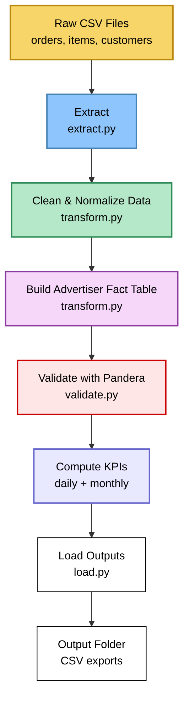

# 📊 Advertiser Analytics ETL Pipeline  
### End-to-End Data Engineering Project (Python, Pandas, Logging, Validation)

This project builds a **production-style ETL pipeline** that processes raw marketplace data (Olist dataset) and transforms it into **analytics-ready advertiser KPIs**.  
It is structured like a real engineering codebase used at Microsoft Advertising, Amazon Marketplace Analytics, and other retail media platforms.

---

## 🚀 Project Summary

This pipeline:

- Loads raw marketplace data (orders, items, customers, products)  
- Cleans & validates the datasets  
- Builds an advertiser-level **fact table**  
- Computes daily & monthly KPIs  
- Enforces data quality with **Pandera schema validation**  
- Logs every ETL stage  
- Outputs clean CSVs ready for BI dashboards or analytics  

The structure follows real DE standards with a modular **src/** package.

---

## 🧱 Tech Stack

- **Python 3.11**
- **Pandas**  
- **Pandera**  
- **Pathlib**  
- **Logging**  
- **Conda environment**  

---

## 📁 Project Structure

```
ms_ad_analytics_project/
│
├── data/                           # Raw input CSVs (ignored by Git)
├── output/                         # Final KPI outputs
│
├── src/
│   ├── extract.py                  # Extract step
│   ├── transform.py                # Clean, merge, build fact table
│   ├── validate.py                 # Pandera schemas
│   ├── load.py                     # Save outputs
│   ├── logger.py                   # Custom logger
│   ├── config.py                   # Config + log level
│   ├── pipeline.py                 # Main ETL pipeline
│   └── __init__.py
│
├── advertiser_spend_analytics.ipynb
├── .gitignore
└── README.md
```

---

## 🏗️ Pipeline Architecture (Mermaid Diagram)


---

## 📊 KPIs Produced

Each advertiser receives:

| Metric | Description |
|--------|-------------|
| **orders** | Unique order count |
| **lines** | Items sold |
| **revenue** | price + freight (line-level revenue) |
| **customers** | Unique buyers |

Outputs delivered:

- **Daily KPIs**  
- **Monthly KPIs**  
- **Advertiser-level fact table**

---

## 📦 Fact Table Schema (Advertiser-Level)

Key fields:

- `advertiser_id`  
- `order_id`  
- `customer_id`  
- `order_item_id`  
- `order_date`  
- `order_month`  
- `line_revenue`  

This mirrors a real **fact_sales** dataset used in enterprise analytics.

---

## ⚙️ How to Run the Pipeline

### 1️⃣ Create & activate environment  
```
conda create -n msad python=3.11 -y
conda activate msad
```

### 2️⃣ Install dependencies  
```
pip install pandas pandera pyarrow python-dotenv pytest
```

### 3️⃣ Run the pipeline  
```
python -m src.pipeline
```

### 4️⃣ Outputs will appear in `/output`  
```
output/daily_advertiser_kpis.csv
output/monthly_advertiser_kpis.csv
```

---

## 🧪 Data Validation (Pandera)

The pipeline validates:

- Column presence  
- Data types  
- Non-negative revenue  
- Valid IDs  
- Date formatting (`YYYY-MM`)  
- No invalid timestamps  

Validation failures stop the pipeline — matching real production behavior.

---

## 📜 Logging (Production Workflow)

Example log:

```
INFO | Starting ETL pipeline...
INFO | Extract completed successfully.
INFO | Fact table validation passed.
INFO | KPI computation complete.
INFO | Load complete. Files saved to /output.
```

---

## 🎯 Why This Project Matters

This project demonstrates real DE skills:

- ETL design  
- Fact table modeling  
- Data cleaning / normalization  
- KPI engineering  
- Pandera validation  
- Error handling  
- Logging & observability  
- Modular Python project architecture  
- Reproducible environments  

---

## 🌱 Future Enhancements

- Incremental loading  
- Unit tests (pytest)  
- Use DuckDB or dbt for modeling  
- Schedule with Airflow or Prefect  
- Add a BI dashboard (Power BI / Tableau)  

---

## 👤 Author  
**Errol Brown**  
Data Engineering & Analytics  
